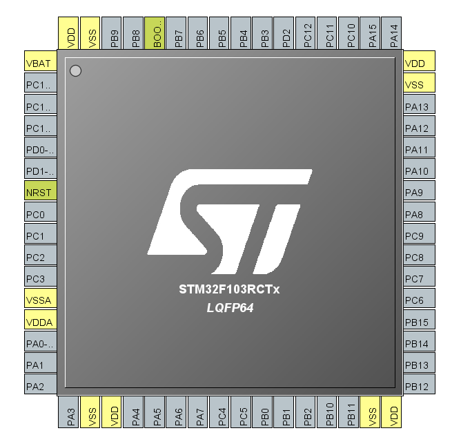
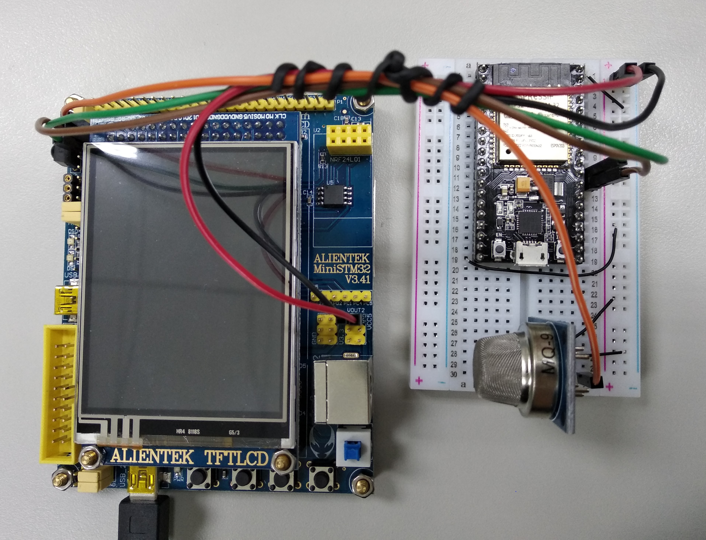
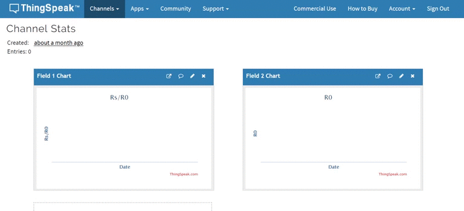

# STM32-Gas-IOT

It a gas detecter with LCD display and ESP8266 IOT (use thing speak for this demo) for STMicroelectronics STM32F103 use Keil ARM MDK v5 IDE  

## Workspace :
>Chip: STMicroelectronics STM32F103RCT6  
>Hardware: ALIENTEK mini STM32F103 development board  
>Display Hardware: ALIENTEK 2.8 inch TFT LCD(chip: ILI9341)  
>WIFI Hardware: ESP8266 or ESP32 (use AT-command mode)  
>IDE: Keil ARM MDK v5 IDE v5.26.2.0  
>STM32CubeMX Version: STM32CubeMX v5.0.1  
>LCD Driver: ALIENTEK LCD driver v3.0  

## Installation :
Install CH340 USB to UART Bridge VCP Drivers [link](https://sparks.gogo.co.nz/ch340.html)  
Makesure you already install Keil ARM MDK IDE and STM32CubeMX  
Makesure your EPS8266 or EPS32 is AT-command mode  
Makesure you choose correct debugger(demo set ST-Link debugger)  
Makesure you have a Think Speak account and api key  
Use Think Speak open a channel with field_1(Rs/R0) and field_2(R0)  
Notice! Open STM32_GAS_IOT.ioc by STM32CubeMX and click "GENERATE CODE" to create Drivers folder

##  Setting :
Open STM32_GAS_IOT.ioc check stm32 chip and all pin define  is correct for your board  
In main.c set WIFI_SSID use (use your wifi ssid)  
In main.c set WIFI_PASSWORD (use your wifi password)  
In main.c set THINK_SPEAK_KEY parameter (use your think speak key)  
In main.h set WIFI_ENABLE parameter to enable or disable eps8266 wifi function  
In main.h set LCD_ENABLE parameter to enable or disable lcd function  

##  Pin Define :
STM32F103RCx pin define   

|MQ-9       |STM32F103RCT6                  |
|-----------|-------------------------------|
|VCC        |VCC 5.0V                       |
|GND        |GND                            |
|AO         |PA1(ADC_1 channel 1)           |
|DO         |None                           |

|ESP32       |STM32F103RCT6                 |
|-----------|-------------------------------|
|VCC        |VCC 5.0V                       |
|GND	    |GND                            |
|GPIO16(Rx) |PA2(UART2 Tx)                  |
|GPIO17(Tx) |PA3(UART2 Rx)                  |

|Button&LED |STM32F103RCT6                  |
|-----------|-------------------------------|
|KEY_0      |PC5(GPIO input)                |
|KEY_1	    |PA15(GPIO input)               |
|WK_UP      |PA0(GPIO input)                |
|LED_0      |PA8(GPIO output)               |
|LED_1      |PD2(GPIO output)               |

LCD pin define refer ALIENTEK mini STM32F103 development board Schematic
Follow the step then you can try to debug now.  
##  Demo :
Flash this firmware and make sure wifi ssid and password and Think Speak key correct  
If all parameters are correct then gas detect will start and LCD will diaplay prompt and every 30's will upload data to Think Speak  

  
ALIENTEK mini STM32F103 development board gas detect and IOT function test  
  
Think Speak get upload data and realtime update(with time-lapse)  
  
